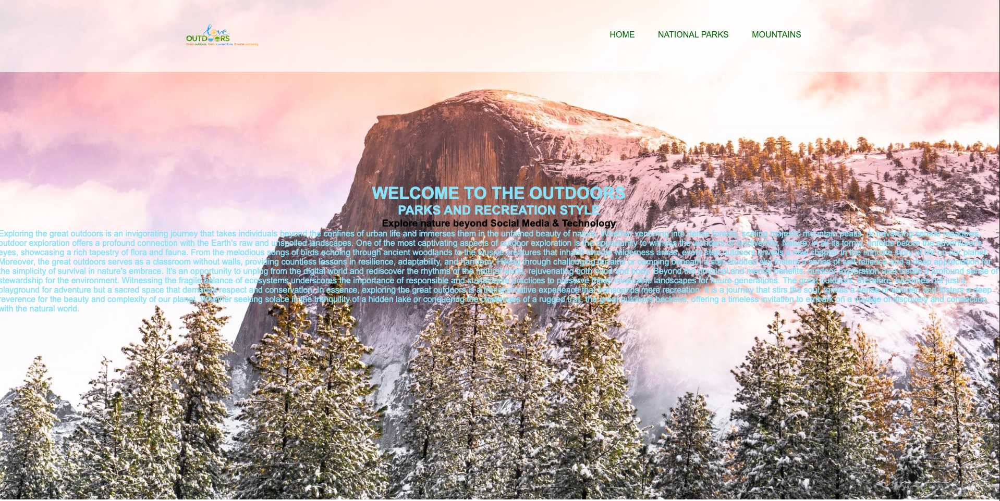
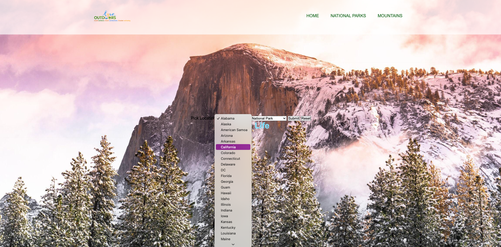
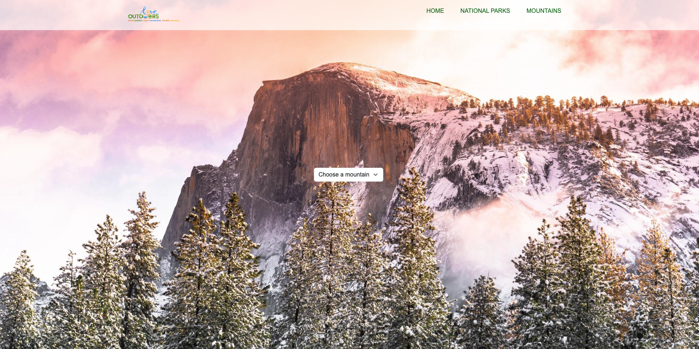

# Capstone 2: Enjoy the outdoors

## Project Overview

The Outdoors Explorer website aims to provide information about various mountains, trails, and outdoor destinations. Users can explore details about different mountains, view images, and get essential information for planning their outdoor adventures.

## Challenges Faced

### 1. **Data Management:**
   Managing a large dataset of mountains, each with its unique information, coordinates, and images, proved to be a complex task. Ensuring data consistency and integrity required a lot of attention to detail.

### 2. **Frontend Design:**
   Crafting an engaging and user-friendly frontend was a significant challenge. Balancing aesthetics with functionality, creating responsive layouts, and ensuring a seamless user experience required continuous refinement and troubleshooting.

### 3. **Image Handling:**
   Incorporating images for each mountain posed challenges in terms of me not getting it completed. 

### 4. **Interactive UI:**
   Implementing an interactive UI for users to explore and select mountains required integrating JavaScript functionalities. Handling user interactions and dynamically updating content added a layer of complexity.

### 5. **Git Workflow:**
   Collaborative development brought its own set of challenges, especially with a team spread across different locations. Resolving merge conflicts, maintaining a clean commit history, and ensuring smooth collaboration were ongoing tasks.

   ## New Grooves

### 1. **Z Index:**

The z-index CSS property sets the z-order of a positioned element and its descendants or flex and grid items. Overlapping elements with a larger z-index cover those with a smaller one. (Think of it like using layers in Adobe Photoshop/Illustrator)

### 2. **Psuedo Code:**
 
 I used the ::after element in my nav bar underneath the different sections of the website! 
